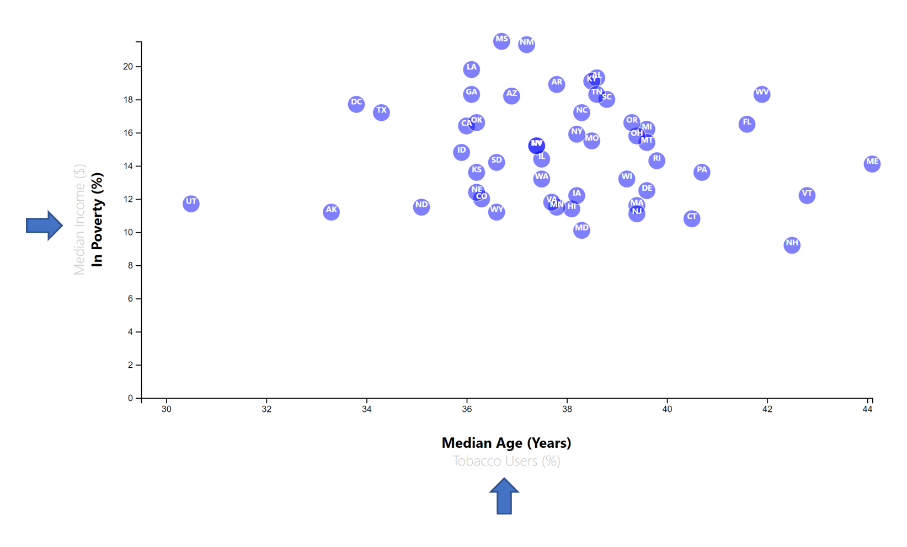

# NYT-Style Scatterplot Made Using D3.js

This repository contains everything required to serve an interactive D3 data visualization as a Flask app on Heroku. The app is interactive in the sense that you can select alternative x and y axes, thereby displaying scatterplots of different pairs of variables (e.g., Age and Median Income, by state). A tooltip is also activated when clicking or tapping a circle on the plot, which displays the name of the state, along with the corresponding values for the selected variables. 

The web app can be accessed using [this link](https://nyt-style-scatterplot.herokuapp.com).
